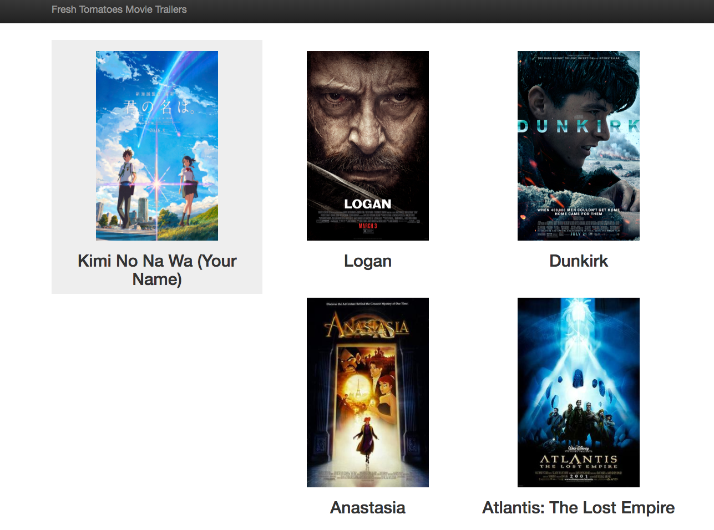

# Movie Trailer Website
Displays my favorite movies that includes poster image and link to a trailer

## Installation
1) Navigate to the project folder through your terminal
2) Run the program using the file "entertainment.py"
```linux
python entertainment.py
```

## Usage Example


## Author
Steven Huynh


[Linkedin](https://www.linkedin.com/in/stevenhuynh17/)
